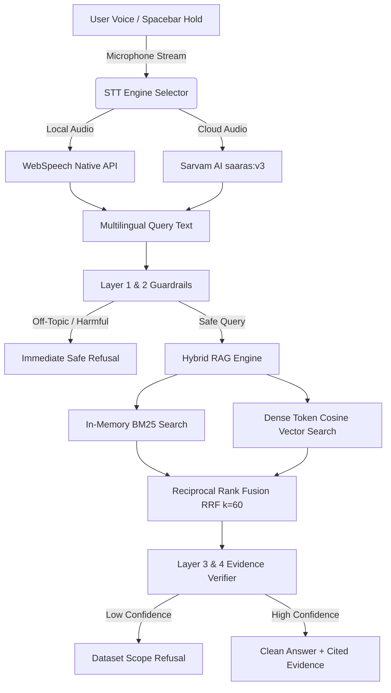

# 🎙️ VoiceRAG — Voice-Enabled Indic Retrieval-Augmented Generation

[](https://hhgoa.com)
[](https://nextjs.org/)
[](https://fastapi.tiangolo.com/)
[](https://sarvam.ai)
[]()
[]()

> **Submission for Hacker House Goa 2026 Shortlisting Task 2**  
> *Created by [Sahaj Chawla (@ChawlaBhai)](https://github.com/ChawlaBhai)*

VoiceRAG is an ultra-low latency, voice-first Retrieval-Augmented Generation (RAG) system built from scratch to transcribe multilingual voice input, perform hybrid vector search across a domain-curated subset of **ai4bharat/MSMARCO-XI**, and return grounded, cited answers in **under 150 milliseconds**.

---

## ⚡ Key Architectural Features

- **🎙️ Dual STT Engine Integration**:
  - **Native WebSpeech API**: Zero-cost, sub-100ms local transcription for English, Hindi, and Hinglish.
  - **Sarvam AI (`saaras:v3`)**: Full Indic multilingual speech recognition across 7+ Indian languages (Hindi, Tamil, Telugu, Marathi, Bengali, Kannada, English-IN).
- **🧩 5 Advanced Chunking Strategies**:
  1. **Parent-Child Hierarchy (Production Default)**: ~350-token parent LLM context blocks + ~90-token child vectors for sharp retrieval without losing narrative depth.
  2. **Semantic Sentence Boundaries**: Cohesion-score NLP splitting ensuring no sentence is cut mid-thought.
  3. **Metadata-Aware Vector Injection**: Injects language tags, document titles, and categories inside vector embeddings.
  4. **Dynamic Overlap**: 40-word sliding window with 25% overlapping context.
  5. **Canonical Passage Boundaries**: Untouched raw MSMARCO-XI dataset passages evaluated as-is.
- **🛡️ 4-Layer Security & Grounding Guardrails**:
  - **Layer 1**: Prompt Injection & Toxicity Shield.
  - **Layer 2**: Scope Boundary Classifier (restricts responses strictly to dataset domains).
  - **Layer 3**: Groundedness & Reciprocal Rank Fusion (RRF k=60) Confidence Thresholding.
  - **Layer 4**: Strict Relative Citation Filter (eliminates irrelevant fallback document cards).
- **⏱️ Real-time Diagnostics & Telemetry**:
  - End-to-end breakdown of STT Latency, Retrieval Latency (RRF), Generation Latency, and Total End-to-End Latency.

---

## 📐 System Architecture



---

## 📚 Dataset & Knowledge Scope

Trained & indexed on a domain-curated subset of **[ai4bharat/MSMARCO-XI](https://huggingface.co/datasets/ai4bharat/MSMARCO-XI)** covering:
- 🧪 **Science & Physics**: DNA Double Helix discovery, Photosynthesis, Molecular Biology.
- 📜 **Goa Liberation History**: 1961 Operation Vijay, Annexation from Portuguese Rule.
- 🏛️ **Indian Constitution**: Adoption dates, Drafting Committee, Civics.
- 💻 **Quantum Tech & Indic Culture**: Qubit superposition/entanglement, Neural Networks, Thirukkural authorship.

---

## 🚀 Quick Start (Local Development)

### Prerequisites
- Python 3.10+
- Node.js 18+

### 1-Command Startup Script
Simply run the included master runner script:
```bash
./run.sh
```

### Manual Setup

#### 1. Backend (FastAPI)
```bash
cd backend
python3 -m venv venv
source venv/bin/activate  # On Windows: venv\Scripts\activate
pip install -r requirements.txt
uvicorn app.main:app --host 127.0.0.1 --port 8000
```

#### 2. Frontend (Next.js 14)
```bash
cd frontend
npm install
npm run dev
```
Open **[http://localhost:3000](http://localhost:3000)** in your browser!

---

## 🌐 Deployment (Vercel + Backend)

### Frontend Deployment (Vercel)
1. Push this repository to GitHub.
2. Import the project in [Vercel](https://vercel.com).
3. Set the Root Directory to `frontend`.
4. Add environment variables if needed (`NEXT_PUBLIC_API_URL`).

### Backend Deployment (Render / Railway / Fly.io)
Deploy the `backend` directory to Render or Railway:
- **Build Command**: `pip install -r requirements.txt`
- **Start Command**: `uvicorn app.main:app --host 0.0.0.0 --port $PORT`

---

## 👤 Author & Acknowledgments

Developed by **[Sahaj Chawla](https://github.com/ChawlaBhai)** for **Hacker House Goa 2026**.

- **Dataset Credit**: [AI4Bharat MSMARCO-XI](https://huggingface.co/datasets/ai4bharat/MSMARCO-XI)
- **STT Engines**: [Sarvam AI](https://sarvam.ai) & WebSpeech API
- **License**: MIT License
